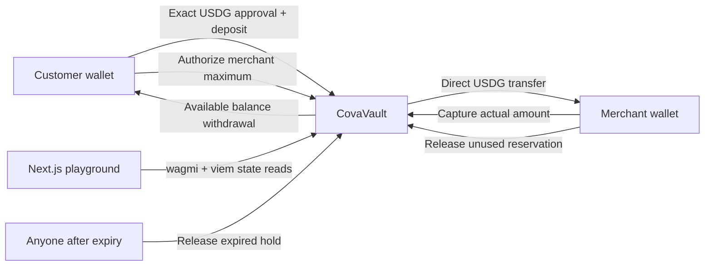

# Cova

**Cova brings card-style authorization and capture to stablecoin payments.**

Reserve now. Settle later.

## Problem

A simple stablecoin transfer settles the entire amount immediately. A rental, booking or charging session often needs a payment guarantee before its final price is known. Charging a maximum upfront forces a later refund and custom accounting.

## Solution

**Authorize → Hold → Capture / Release.** A customer deposits USDG, reserves a maximum for a merchant, and the merchant captures only the final charge. The unused reservation returns to the customer's available Cova balance.

## Example

With 100 USDG deposited:

| Stage | Available | Reserved | Merchant received |
| --- | ---: | ---: | ---: |
| Deposit | 100 | 0 | 0 |
| Authorize 20 | 80 | 20 | 0 |
| Capture 14 | 80 | 6 | 14 |
| Release remainder | 86 | 0 | 14 |

The released 6 remains available inside Cova. The customer can withdraw it together with their other available funds.

## Use Cases

- Bookings and sports courts
- Camera, vehicle and equipment rentals
- Hospitality and service deposits
- EV charging
- Usage-based services

The playground presets configure the same protocol: Court Booking 20/14, Camera Rental 100/72, EV Charging 30/17.42. Cova is reusable payment infrastructure.

## Why Arbitrum

Authorizing, capturing and releasing involve repeated EVM state transitions. Arbitrum is suitable for small payment operations; this MVP targets **Arbitrum Sepolia, chain ID 421614**. ETH is needed for gas.

## Why USDG

USDG is the actual reserved and settled asset on Arbitrum Sepolia. Its official Paxos token address is:

`0xFFC95faa3d63Cde504a05B567C600B78C0b41892`

Verified on 2026-10-03 against [Paxos's USDG test network documentation](https://docs.paxos.com/guides/stablecoin/usdg/testnet) and live RPC (`symbol() = USDG`, `decimals() = 6`, deployed bytecode). This is the token address, not its supply-controller address. Obtain test USDG using the [Paxos test crypto guide](https://docs.paxos.com/guides/developer/fund-sandbox-with-test-crypto); follow its Paxos Testnet Faucet link. Faucet access/availability is managed by Paxos. Obtain Arbitrum Sepolia ETH separately using a compatible gas faucet.

## Architecture



No backend, database, admin, upgradeability or project token. Wallet authorization is enforced by the contract. The frontend discovers hold IDs through paginated contract getters and reads money/status directly from state, at a consistent block. Local browser storage stores optional descriptions and receipt links; it never supplies balances or hold status. Descriptions are hashed into the onchain reference; other browsers see the reference ID and generic title.

## Contracts

`contracts/src/CovaVault.sol` uses Solidity 0.8.30, Foundry, OpenZeppelin SafeERC20 and ReentrancyGuard.

| Operation | Who | Behavior |
| --- | --- | --- |
| `deposit(amount)` | Customer | Transfers approved USDG into available funds |
| `withdraw(amount)` | Customer | Transfers only available funds back to their wallet |
| `createHold(merchant, amount, expiresAt, referenceId)` | Customer | Moves available funds into reserved funds |
| `capture(holdId, amount)` | Assigned merchant | Transfers the requested part directly to that merchant |
| `release(holdId)` | Assigned merchant | Closes an active hold and releases its remainder |
| `releaseExpired(holdId)` | Anyone | Returns the remainder to the customer at/after expiry |

Accounting uses immediate merchant settlement, with no merchant withdrawal queue. `availableBalance(customer)` and `heldBalance(customer)` are customer liabilities. `totalLiability` equals all available plus all reserved balances and must be covered by the vault's token balance. Captures and withdrawals decrease liabilities; holds and releases preserve them. Captured funds have left the vault and are never counted as customer balance again.

For a customer, **lifetime net deposits = available + reserved + captured**; withdrawals must be subtracted from deposits for this equation. Gross deposits = available + reserved + captured + withdrawn. Token donations are surplus and do not create customer credit.

Hold states are `None=0`, `Active=1`, `Captured=2`, `Released=3`. Multiple partial captures are supported. Full capture closes the hold. A release after partial capture closes it while preserving the captured amount. Remaining/released amounts are derived from the maximum and captured amount. References may be reused; IDs include vault, chain, customer and monotonic nonce.

Time alone does not update storage. An expired active hold remains reserved until someone submits `releaseExpired`. Capture is forbidden **at or after** `expiresAt`. Before expiry the customer cannot revoke the merchant guarantee. Live expiry UI uses chain time.

## Security

- Immutable settlement token and no privileged drain/admin path
- Merchant permissions checked onchain; changing UI views grants no permission
- Positive amounts, available-fund limits, uint128 authorization bounds, future expiry and nonzero/non-vault merchant validation
- Terminal holds cannot be captured or released again
- SafeERC20, guarded mutators, and checks/effects before outbound token transfers
- Exact inbound/outbound token balance deltas reject fee-on-transfer behavior and restore accounting on failure
- Exact token approvals in the UI; each deposit requires its own approval if allowance is consumed
- Live frontend verifies chain, vault/token bytecode, token identity and metadata
- Cancelled or changed replacement transactions are failures; repriced receipts use the new hash
- No private key ever enters the frontend; `.env*`, broadcast outputs and local deployment metadata are ignored

This is a hackathon MVP, not an audited production payment service. USDG issuer freezes/pauses and token upgrades remain external dependencies. Unsupported/rebasing tokens are outside the accounting model. Direct token donations have no rescue function.

## Local Development

Requirements: Node.js **22.8+** (validated with 24.13), npm, and Foundry (`forge`, `anvil`, `cast`). forge-std is vendored at a pinned release; OpenZeppelin is installed through the npm lockfile.

From the repository root:

```bash
npm ci
cp .env.example .env.local
npm run dev
```

Open http://localhost:3000. With an empty vault address, the app clearly shows **Demo Mode**. It starts with simulated 100 available USDG and 400 wallet USDG. Simulated roles use no wallet signatures or blockchain transactions, and never show fabricated Arbiscan links. Reset demo returns to that initial state.

### Real local transactions with Anvil

Terminal 1:

```bash
anvil --host 127.0.0.1 --port 8545 --chain-id 31337
```

Terminal 2:

```bash
forge build --root contracts
npm run abi
npm run local:deploy
npm run test:integration
```

The local deploy command creates a **test-only MockUSDG fixture**, funds Anvil account 0, deploys CovaVault and writes `.env.anvil` plus `local-deployment.json`. It never deploys a project token to Arbitrum and never overwrites `.env.local`. The well-known test mnemonic is exclusively for Anvil; use the accounts printed by Anvil with a disposable development wallet. Account 0 is the customer and account 1 is the merchant.

Start the frontend with the generated environment (Bash):

```bash
set -a
source .env.anvil
set +a
npm run dev
```

Restart the frontend when changing its environment. Explicit shell values override `.env.local`. Local Anvil transactions have local receipts and **no Arbiscan links**. The app labels the local network; MockUSDG is not Paxos USDG.

## Testing

```bash
# Foundry unit, fuzz, hostile-token and invariant tests
forge test --root contracts
forge fmt --root contracts --check

# Actual official Paxos USDG on a read-only Arbitrum Sepolia fork
ARB_SEPOLIA_RPC_URL=https://sepolia-rollup.arbitrum.io/rpc \
  forge test --root contracts --match-contract CovaVaultForkTest -vv

# Money validation, demo accounting and wallet replacement handling
npm test
npm run typecheck
npm run lint
npm run build

# Requires running Anvil and npm run local:deploy
npm run test:integration
npm run test:e2e
```

Fork tests are opt-in: the default suite requires no network. The fork funds a test address locally; it sends no transactions to Arbitrum. Browser tests exercise the simulated demo and, when `local-deployment.json` exists, real Anvil transactions using an injected test provider with unlocked local signers. They cover chain switching, rejected approval, customer/merchant separation, partial capture, release, withdrawal, expiry, RPC Retry and mobile overflow. Without local deployment metadata, only the three live browser tests are skipped. To install Chromium on a new machine, run `npx playwright install chromium` (or `npx playwright install --with-deps chromium` when system libraries are needed).

## Deployment

**CovaVault has not been broadcast to Arbitrum Sepolia in this handoff.** Deployment credentials were unavailable. The local Anvil deployment and official USDG fork tests validate execution; their addresses/hashes are not public deployments.

Create an ignored `.env` with the actual deployer key, RPC and official USDG address. Fund that deployer with Arbitrum Sepolia ETH. From the repository root:

```bash
set -a
source .env
set +a
forge script contracts/script/Deploy.s.sol:Deploy --root contracts \
  --rpc-url "$ARB_SEPOLIA_RPC_URL" --broadcast
```

The deployment script checks chain 421614, official USDG address, deployed token code, symbol and six decimals. It never uses a substitute token on Arbitrum. Read the deployed vault address from Foundry's actual broadcast output, put it in `NEXT_PUBLIC_COVA_VAULT_ADDRESS` in `.env.local`, then restart/rebuild Next.js. Confirm `cast call <vault> 'token()(address)' --rpc-url "$ARB_SEPOLIA_RPC_URL"` matches the official address. Receipts link to `https://sepolia.arbiscan.io/tx/<hash>`.

## Environment Variables

| Variable | Purpose |
| --- | --- |
| `NEXT_PUBLIC_COVA_VAULT_ADDRESS` | Actual vault address; empty enables simulation |
| `NEXT_PUBLIC_USDG_ADDRESS` | Official address above, or generated local MockUSDG on chain 31337 |
| `NEXT_PUBLIC_CHAIN_ID` | 421614 for Arbitrum Sepolia, 31337 for explicitly local development |
| `NEXT_PUBLIC_RPC_URL` | Browser-readable RPC endpoint; do not embed a private credential here |
| `NEXT_PUBLIC_DEMO_MERCHANT_ADDRESS` | Optional merchant input default; that wallet must sign actual merchant transactions |
| `ARB_SEPOLIA_RPC_URL` | Foundry deploy/fork RPC |
| `DEPLOYER_PRIVATE_KEY` | Deployment secret; never prefixed `NEXT_PUBLIC_` |
| `USDG_ADDRESS` | Foundry settlement token address |

No WalletConnect project ID is needed; the MVP uses one injected wallet connector. See `.env.example` for values actually used. Tests use an internal `NEXT_DIST_DIR` to isolate their development build directories.

## GitHub Checks

The GitHub Actions workflow runs TypeScript, lint, domain tests, Foundry unit/fuzz/invariant tests, formatting, production build, a two-wallet Anvil integration and all browser scenarios on pushes and pull requests. It pins action revisions and Foundry v1.5.1. CI never deploys to Arbitrum or receives a deployment private key. Official USDG fork tests remain opt-in through the command above.

## Demo Flow

1. Connect the customer wallet and switch to Arbitrum Sepolia.
2. Obtain USDG and ETH for gas; enter 100 USDG, approve exactly 100, then deposit.
3. Enter the merchant wallet address, select Court Booking, and authorize 20 USDG.
4. Confirm available decreases by 20 and reserved increases by 20.
5. Switch to the merchant wallet and select Merchant. Its assigned holds are read from the vault.
6. Capture 14 USDG; the merchant wallet receives 14 and 6 remains reserved.
7. Release remaining; customer available becomes 86, reserved becomes 0, and the hold is settled.
8. Inspect authorization/capture/release receipts under Authorization details. Withdraw available funds if desired.

Demo Mode follows the same accounting with labelled simulated roles. A single real wallet may authorize itself, but switching views still uses that actual wallet's onchain permissions; the intended demo uses two separate wallets.

## Known Limitations

- Public vault deployment and an actual funded customer/merchant Arbitrum browser session remain external setup steps; no deployment is claimed without a broadcast.
- Holds use normal customer transactions. EIP-712 signatures and relayers are deferred.
- Expiry cleanup requires a transaction; no scheduler runs automatically.
- Human-readable references and action receipt links are browser-local. Hold discovery, amounts, expiry and status remain onchain and recover across browsers.
- All pages of an account's hold history are read directly; a high-volume production integration should add indexing and UI pagination.
- Dependency audit findings are recorded in `docs/VALIDATION.md`; review them before production use.

## Future Roadmap

1. Deploy/verify the vault on Arbitrum Sepolia and record a two-wallet demo with official faucet USDG.
2. Add EIP-712 customer authorizations with domain binding, nonces and replay tests, then a small merchant SDK.
3. Add indexing and shared receipt/reference history for integrations; address dependency advisories and commission a security audit before production.

Later: relayers, merchant APIs, embedded checkout, account abstraction, multiple settlement assets, merchant analytics and carefully scoped dispute extensions.
